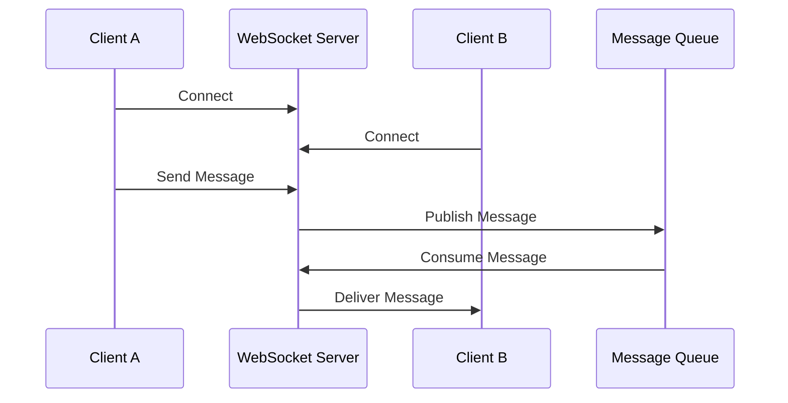

# Chat App (Messenger Clone)

## Problem Statement
Design and implement a real-time chat application similar to Facebook Messenger or WhatsApp. The application should support:

### Core Features
- Real-time messaging between users
- Message history
- Typing indicators
- File sharing
- Group chat functionality
- Unread message count badges

### Additional Features
- Message reactions
- Message editing
- Message deletion
- Message forwarding
- Voice messages
- Video calls

## System Requirements

### Functional Requirements
1. **User Management**
   - User registration and authentication
   - User profiles with avatars
   - Online/offline status
   - Last seen timestamp
   - User blocking
   - User reporting

2. **Messaging Features**
   - One-to-one chat
   - Group chat support
   - Real-time message delivery
   - Message status (sent, delivered, read)
   - Typing indicators
   - Message history
   - Message search
   - File sharing (images, documents, etc.)
   - Message reactions
   - Message editing
   - Message deletion

3. **Notifications**
   - Push notifications for new messages
   - Unread message count badges
   - Desktop notifications
   - Email notifications
   - Sound alerts
   - Vibration alerts

### Non-Functional Requirements
1. **Performance**
   - Message delivery latency < 100ms
   - Support for 1M+ concurrent users
   - 99.9% uptime
   - Low battery consumption
   - Efficient data usage

2. **Scalability**
   - Horizontal scaling
   - Load balancing
   - Database sharding
   - CDN integration
   - Geographic distribution

3. **Security**
   - End-to-end encryption
   - Secure file transfer
   - Rate limiting
   - DDoS protection
   - Data privacy
   - GDPR compliance

## High-Level Architecture

### Components
1. **Client Applications**
   - Web client (React)
   - Mobile clients (iOS/Android)
   - Desktop client (Electron)
   - Progressive Web App (PWA)

2. **Backend Services**
   - API Gateway
   - Authentication Service
   - Chat Service
   - File Service
   - Notification Service
   - Presence Service
   - Analytics Service

3. **Data Storage**
   - User Database (PostgreSQL)
   - Message Database (MongoDB)
   - File Storage (S3)
   - Cache (Redis)
   - Search Index (Elasticsearch)

4. **Real-time Communication**
   - WebSocket Server
   - Message Queue (Kafka)
   - Load Balancer
   - CDN

## Detailed Design

### 1. Real-time Communication


### 2. Message Flow
1. **Message Sending**
   - Client sends message to WebSocket server
   - Server acknowledges receipt
   - Message is stored in database
   - Message is published to message queue
   - Recipients receive message via WebSocket

2. **Message History**
   - Messages stored in MongoDB
   - Sharded by chat ID
   - Indexed by timestamp
   - Pagination for history loading

### 3. File Sharing
1. **Upload Process**
   - Client uploads file to S3
   - File metadata stored in database
   - File URL sent in chat message
   - Recipients can download/view file

2. **File Types**
   - Images (thumbnails generated)
   - Documents (preview available)
   - Videos (streaming support)

### 4. Group Chat
1. **Group Management**
   - Create/delete groups
   - Add/remove members
   - Group roles (admin, member)
   - Group settings

2. **Message Distribution**
   - Fan-out to all group members
   - Optimistic UI updates
   - Conflict resolution

## Database Schema

### Users Collection
```json
{
  "userId": "string",
  "username": "string",
  "email": "string",
  "password": "string (hashed)",
  "avatar": "string (URL)",
  "status": "string",
  "lastSeen": "timestamp"
}
```

### Messages Collection
```json
{
  "messageId": "string",
  "chatId": "string",
  "senderId": "string",
  "content": "string",
  "type": "string (text/image/file)",
  "timestamp": "timestamp",
  "status": "string",
  "metadata": "object"
}
```

### Chats Collection
```json
{
  "chatId": "string",
  "type": "string (private/group)",
  "participants": ["userId"],
  "lastMessage": "object",
  "createdAt": "timestamp",
  "updatedAt": "timestamp"
}
```

## API Endpoints

### Authentication
```
POST /api/auth/register
POST /api/auth/login
POST /api/auth/logout
GET /api/auth/me
```

### Chats
```
GET /api/chats
POST /api/chats
GET /api/chats/:chatId
POST /api/chats/:chatId/messages
GET /api/chats/:chatId/messages
```

### Users
```
GET /api/users
GET /api/users/:userId
PUT /api/users/:userId
```

### Files
```
POST /api/files/upload
GET /api/files/:fileId
```

## WebSocket Events

### Client to Server
```typescript
interface ClientEvents {
  'message:send': (message: Message) => void;
  'typing:start': (chatId: string) => void;
  'typing:stop': (chatId: string) => void;
  'presence:update': (status: string) => void;
}
```

### Server to Client
```typescript
interface ServerEvents {
  'message:new': (message: Message) => void;
  'message:status': (status: MessageStatus) => void;
  'typing:update': (data: TypingData) => void;
  'presence:update': (data: PresenceData) => void;
}
```

## Implementation Considerations

### 1. Real-time Features
- Use WebSocket for real-time communication
- Implement heartbeat mechanism
- Handle connection drops and reconnection
- Implement message queuing for offline users

### 2. Performance Optimization
- Implement message pagination
- Use Redis for caching
- Implement message batching
- Use CDN for static assets

### 3. Security Measures
- Implement rate limiting
- Use JWT for authentication
- Encrypt sensitive data
- Implement input validation
- Use HTTPS for all communications

### 4. Monitoring and Logging
- Track message delivery latency
- Monitor WebSocket connections
- Log error rates
- Track user engagement metrics

## Testing Strategy

### 1. Unit Tests
- Message formatting
- User authentication
- File handling

### 2. Integration Tests
- Message flow
- Real-time updates
- File upload/download

### 3. Load Tests
- Concurrent users
- Message throughput
- File transfer performance

### 4. Security Tests
- Authentication
- Authorization
- Data encryption

## Deployment Strategy

### 1. Infrastructure
- Use Kubernetes for container orchestration
- Implement auto-scaling
- Use multiple availability zones
- Implement disaster recovery

### 2. CI/CD
- Automated testing
- Blue-green deployment
- Rollback capability
- Monitoring and alerts

## Future Enhancements

1. **Advanced Features**
   - Voice messages
   - Video calls
   - Message reactions
   - Message editing
   - Message deletion

2. **AI Features**
   - Smart replies
   - Message translation
   - Content moderation
   - Chat summarization

3. **Analytics**
   - User engagement metrics
   - Message patterns
   - Performance metrics
   - Business insights

## Conclusion
This system design provides a scalable and maintainable architecture for a real-time chat application. The design focuses on:
- Real-time communication
- Scalability
- Security
- Performance
- User experience

The implementation should be done in phases, starting with core features and gradually adding more complex functionality. 