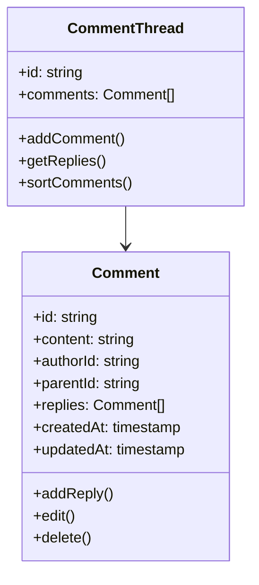

# Comment Thread (YouTube/Facebook)

## Problem Statement

Design and implement a comment thread system similar to YouTube or Facebook. The system should support:

- Nested comments and replies
- Comment editing and deletion
- Real-time updates
- Lazy loading of replies
- Comment moderation

## System Requirements

### Functional Requirements

1. **Comment Features**

   - Nested comments (unlimited depth)
   - Comment editing
   - Comment deletion
   - Reply functionality
   - Comment reactions
   - Comment sorting

2. **User Features**

   - User profiles
   - Comment history
   - Notifications
   - Moderation tools
   - Content filtering

3. **Content Management**
   - Rich text formatting
   - Media embedding
   - Link previews
   - Spam detection
   - Content moderation

### Non-Functional Requirements

1. **Performance**

   - Comment load time < 1s
   - Real-time updates < 500ms
   - Support for 1M+ comments
   - 99.9% uptime

2. **Scalability**

   - Horizontal scaling
   - Data partitioning
   - Caching strategy
   - CDN integration

3. **Security**
   - Content security
   - Rate limiting
   - DDoS protection
   - Data privacy

## High-Level Architecture

### Components

1. **Client Applications**

   - Web client (React)
   - Mobile clients (iOS/Android)
   - API Gateway

2. **Backend Services**

   - Comment Service
   - User Service
   - Moderation Service
   - Notification Service
   - Analytics Service

3. **Data Storage**

   - Comment Database (MongoDB)
   - User Database (PostgreSQL)
   - Cache (Redis)
   - Search Index (Elasticsearch)

4. **Real-time Communication**
   - WebSocket Server
   - Message Queue (Kafka)

## Detailed Design

### 1. Comment Thread Structure



### 2. Comment Flow

1. **Comment Creation**

   - User submits comment
   - Content validation
   - Spam check
   - Real-time broadcast
   - Cache update

2. **Reply Management**

   - Lazy loading
   - Pagination
   - Sorting options
   - Thread collapsing

3. **Moderation Flow**
   - Content filtering
   - Spam detection
   - User reporting
   - Moderation actions

### 3. Real-time Updates

1. **WebSocket Events**

   - New comments
   - Comment edits
   - Comment deletions
   - Reply notifications

2. **Optimistic Updates**
   - Client-side caching
   - Conflict resolution
   - State synchronization

## Database Schema

### Comments Collection

```json
{
  "commentId": "string",
  "content": "string",
  "authorId": "string",
  "parentId": "string",
  "threadId": "string",
  "replies": [
    {
      "commentId": "string",
      "content": "string",
      "authorId": "string",
      "createdAt": "timestamp"
    }
  ],
  "stats": {
    "likes": "number",
    "replies": "number"
  },
  "status": "string",
  "createdAt": "timestamp",
  "updatedAt": "timestamp"
}
```

### Threads Collection

```json
{
  "threadId": "string",
  "contentId": "string",
  "comments": [
    {
      "commentId": "string",
      "score": "number",
      "timestamp": "timestamp"
    }
  ],
  "stats": {
    "totalComments": "number",
    "totalReplies": "number"
  },
  "settings": {
    "sorting": "string",
    "moderation": "string"
  }
}
```

### Users Collection

```json
{
  "userId": "string",
  "username": "string",
  "profile": {
    "avatar": "string",
    "bio": "string"
  },
  "moderation": {
    "role": "string",
    "permissions": ["string"]
  },
  "preferences": {
    "notifications": "boolean",
    "sorting": "string"
  }
}
```

## API Endpoints

### Comments

```
GET /api/comments/:threadId
POST /api/comments/:threadId
PUT /api/comments/:commentId
DELETE /api/comments/:commentId
```

### Replies

```
GET /api/comments/:commentId/replies
POST /api/comments/:commentId/replies
PUT /api/replies/:replyId
DELETE /api/replies/:replyId
```

### Moderation

```
GET /api/moderation/reports
POST /api/moderation/actions
PUT /api/moderation/settings
```

### Users

```
GET /api/users/:userId/comments
GET /api/users/:userId/notifications
PUT /api/users/:userId/preferences
```

## Implementation Considerations

### 1. Performance Optimization

- Implement comment pagination
- Use Redis for caching
- Implement lazy loading
- Use CDN for static assets
- Implement virtual scrolling

### 2. Data Consistency

- Use eventual consistency model
- Implement conflict resolution
- Handle offline scenarios
- Implement data synchronization

### 3. Security Measures

- Implement rate limiting
- Use JWT for authentication
- Validate user input
- Implement content moderation
- Use HTTPS for all communications

### 4. Monitoring and Analytics

- Track comment performance
- Monitor user behavior
- Log error rates
- Track moderation metrics

## Testing Strategy

### 1. Unit Tests

- Comment creation
- Reply management
- Moderation actions
- Content filtering

### 2. Integration Tests

- Comment flow
- Real-time updates
- Moderation flow
- Notification delivery

### 3. Load Tests

- Concurrent users
- Comment creation
- Reply loading
- Real-time updates

### 4. Security Tests

- Authentication
- Authorization
- Rate limiting
- Content security

## Deployment Strategy

### 1. Infrastructure

- Use Kubernetes for container orchestration
- Implement auto-scaling
- Use multiple availability zones
- Implement disaster recovery

### 2. CI/CD

- Automated testing
- Blue-green deployment
- Rollback capability
- Monitoring and alerts

## Future Enhancements

1. **Advanced Features**

   - Rich text editor
   - Media embedding
   - Comment reactions
   - Thread pinning
   - Comment search

2. **AI Features**

   - Spam detection
   - Content moderation
   - Sentiment analysis
   - Comment summarization

3. **Analytics**
   - User engagement metrics
   - Content performance
   - Moderation insights
   - Business analytics

## Conclusion

This system design provides a scalable and maintainable architecture for a comment thread system. The design focuses on:

- Real-time updates
- Performance optimization
- Content moderation
- Scalability
- User experience

The implementation should be done in phases, starting with core features and gradually adding more complex functionality.
