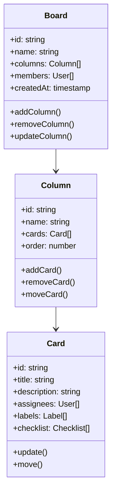

# Kanban Board (Trello Clone)

## Problem Statement

Design and implement a Kanban board application similar to Trello. The system should support:

- Drag and drop functionality
- Real-time updates
- Board and card management
- Offline mode
- State synchronization

## System Requirements

### Functional Requirements

1. **Board Features**

   - Create/edit/delete boards
   - Multiple columns (lists)
   - Drag and drop cards
   - Card assignments
   - Board sharing
   - Board templates

2. **Card Features**

   - Create/edit/delete cards
   - Card descriptions
   - Card attachments
   - Card comments
   - Card labels
   - Card checklists

3. **User Features**
   - User authentication
   - Team management
   - Activity tracking
   - Notifications
   - Search functionality

### Non-Functional Requirements

1. **Performance**

   - Board load time < 2s
   - Real-time updates < 500ms
   - Support for 100K+ cards
   - 99.9% uptime

2. **Scalability**

   - Horizontal scaling
   - Data partitioning
   - Caching strategy
   - CDN integration

3. **Security**
   - Access control
   - Rate limiting
   - DDoS protection
   - Data privacy

## High-Level Architecture

### Components

1. **Client Applications**

   - Web client (React)
   - Mobile clients (iOS/Android)
   - API Gateway

2. **Backend Services**

   - Board Service
   - Card Service
   - User Service
   - Notification Service
   - Analytics Service

3. **Data Storage**

   - Board Database (PostgreSQL)
   - Card Database (MongoDB)
   - Cache (Redis)
   - File Storage (S3)

4. **Real-time Communication**
   - WebSocket Server
   - Message Queue (Kafka)

## Detailed Design

### 1. Board Structure



### 2. Drag and Drop Flow

1. **Card Movement**

   - Start drag operation
   - Calculate drop position
   - Update card order
   - Broadcast changes
   - Sync with server

2. **Column Movement**

   - Start drag operation
   - Calculate new order
   - Update column order
   - Broadcast changes
   - Sync with server

3. **State Management**
   - Optimistic updates
   - Conflict resolution
   - Offline support
   - State synchronization

### 3. Real-time Updates

1. **WebSocket Events**

   - Card updates
   - Column updates
   - Board updates
   - Member updates

2. **Optimistic Updates**
   - Client-side caching
   - Conflict resolution
   - State synchronization

## Database Schema

### Boards Collection

```json
{
  "boardId": "string",
  "name": "string",
  "description": "string",
  "columns": [
    {
      "columnId": "string",
      "name": "string",
      "order": "number",
      "cards": ["cardId"]
    }
  ],
  "members": [
    {
      "userId": "string",
      "role": "string",
      "joinedAt": "timestamp"
    }
  ],
  "settings": {
    "visibility": "string",
    "permissions": "object"
  },
  "createdAt": "timestamp",
  "updatedAt": "timestamp"
}
```

### Cards Collection

```json
{
  "cardId": "string",
  "boardId": "string",
  "columnId": "string",
  "title": "string",
  "description": "string",
  "assignees": ["userId"],
  "labels": [
    {
      "id": "string",
      "name": "string",
      "color": "string"
    }
  ],
  "checklist": [
    {
      "id": "string",
      "title": "string",
      "items": [
        {
          "id": "string",
          "text": "string",
          "completed": "boolean"
        }
      ]
    }
  ],
  "attachments": [
    {
      "id": "string",
      "name": "string",
      "url": "string",
      "type": "string"
    }
  ],
  "comments": [
    {
      "id": "string",
      "userId": "string",
      "text": "string",
      "createdAt": "timestamp"
    }
  ],
  "order": "number",
  "createdAt": "timestamp",
  "updatedAt": "timestamp"
}
```

### Users Collection

```json
{
  "userId": "string",
  "username": "string",
  "email": "string",
  "profile": {
    "avatar": "string",
    "bio": "string"
  },
  "boards": [
    {
      "boardId": "string",
      "role": "string",
      "lastViewed": "timestamp"
    }
  ],
  "preferences": {
    "notifications": "boolean",
    "theme": "string"
  }
}
```

## API Endpoints

### Boards

```
GET /api/boards
POST /api/boards
GET /api/boards/:boardId
PUT /api/boards/:boardId
DELETE /api/boards/:boardId
```

### Columns

```
GET /api/boards/:boardId/columns
POST /api/boards/:boardId/columns
PUT /api/columns/:columnId
DELETE /api/columns/:columnId
```

### Cards

```
GET /api/columns/:columnId/cards
POST /api/columns/:columnId/cards
PUT /api/cards/:cardId
DELETE /api/cards/:cardId
```

### Users

```
GET /api/users/:userId/boards
GET /api/users/:userId/notifications
PUT /api/users/:userId/preferences
```

## Implementation Considerations

### 1. Performance Optimization

- Implement virtual scrolling
- Use Redis for caching
- Implement lazy loading
- Use CDN for static assets
- Optimize drag and drop

### 2. Offline Support

- Implement service workers
- Use IndexedDB
- Handle conflicts
- Sync on reconnect
- Queue operations

### 3. Security Measures

- Implement rate limiting
- Use JWT for authentication
- Validate user input
- Implement access control
- Use HTTPS for all communications

### 4. Monitoring and Analytics

- Track board performance
- Monitor user behavior
- Log error rates
- Track usage metrics

## Testing Strategy

### 1. Unit Tests

- Board operations
- Card operations
- Drag and drop
- State management

### 2. Integration Tests

- Board flow
- Real-time updates
- Offline functionality
- Sync mechanism

### 3. Load Tests

- Concurrent users
- Board operations
- Card operations
- Real-time updates

### 4. Security Tests

- Authentication
- Authorization
- Rate limiting
- Access control

## Deployment Strategy

### 1. Infrastructure

- Use Kubernetes for container orchestration
- Implement auto-scaling
- Use multiple availability zones
- Implement disaster recovery

### 2. CI/CD

- Automated testing
- Blue-green deployment
- Rollback capability
- Monitoring and alerts

## Future Enhancements

1. **Advanced Features**

   - Board templates
   - Power-ups
   - Automation
   - Calendar view
   - Timeline view

2. **AI Features**

   - Smart suggestions
   - Task prioritization
   - Workload balancing
   - Progress prediction

3. **Analytics**
   - Team performance
   - Workflow analysis
   - Productivity metrics
   - Business insights

## Conclusion

This system design provides a scalable and maintainable architecture for a Kanban board application. The design focuses on:

- Real-time updates
- Offline support
- Performance optimization
- Scalability
- User experience

The implementation should be done in phases, starting with core features and gradually adding more complex functionality.
