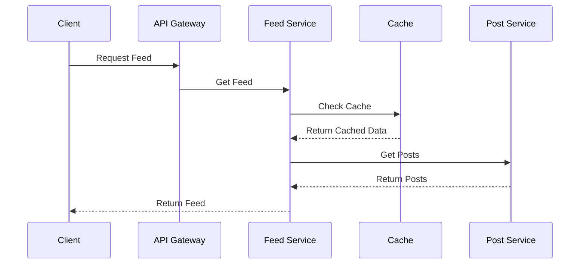

# News Feed (Facebook/Twitter)

## Problem Statement

Design and implement a social media news feed system similar to Facebook or Twitter. The system should support:

- Real-time feed updates
- Infinite scroll
- Post creation and interaction
- Content personalization
- Performance optimization for large-scale data

## System Requirements

### Functional Requirements

1. **Feed Features**

   - Post creation (text, images, videos)
   - Real-time feed updates
   - Infinite scroll
   - Post interactions (like, comment, share)
   - Content personalization
   - Trending topics

2. **User Features**

   - User profiles
   - Follow/unfollow
   - Content discovery
   - Notifications
   - Activity tracking

3. **Content Management**
   - Content moderation
   - Spam detection
   - Content filtering
   - Media processing

### Non-Functional Requirements

1. **Performance**

   - Feed load time < 2s
   - Real-time updates < 1s
   - Support for 10M+ daily active users
   - 99.9% uptime

2. **Scalability**

   - Horizontal scaling
   - Data partitioning
   - Caching strategy
   - CDN integration

3. **Security**
   - Content security
   - Rate limiting
   - DDoS protection
   - Data privacy

## High-Level Architecture

### Components

1. **Client Applications**

   - Web client (React)
   - Mobile clients (iOS/Android)
   - API Gateway

2. **Backend Services**

   - Feed Service
   - Post Service
   - User Service
   - Media Service
   - Notification Service
   - Analytics Service

3. **Data Storage**

   - User Database (PostgreSQL)
   - Post Database (MongoDB)
   - Cache (Redis)
   - Media Storage (S3)
   - Search Index (Elasticsearch)

4. **Real-time Communication**
   - WebSocket Server
   - Message Queue (Kafka)

## Detailed Design

### 1. Feed Generation



### 2. Post Creation Flow

1. **Content Processing**

   - Text processing
   - Media upload
   - Content validation
   - Spam detection

2. **Distribution**
   - Fan-out to followers
   - Cache invalidation
   - Search index update
   - Analytics tracking

### 3. Feed Personalization

1. **Content Ranking**

   - User preferences
   - Engagement metrics
   - Time decay
   - Content relevance

2. **Recommendation Engine**
   - User behavior analysis
   - Content similarity
   - Collaborative filtering
   - Machine learning models

### 4. Real-time Updates

1. **WebSocket Events**

   - New posts
   - Interactions
   - Notifications
   - Status updates

2. **Optimistic Updates**
   - Client-side caching
   - Conflict resolution
   - State synchronization

## Database Schema

### Users Collection

```json
{
  "userId": "string",
  "username": "string",
  "email": "string",
  "profile": {
    "name": "string",
    "bio": "string",
    "avatar": "string"
  },
  "followers": ["userId"],
  "following": ["userId"],
  "createdAt": "timestamp"
}
```

### Posts Collection

```json
{
  "postId": "string",
  "authorId": "string",
  "content": "string",
  "media": [
    {
      "type": "string",
      "url": "string"
    }
  ],
  "stats": {
    "likes": "number",
    "comments": "number",
    "shares": "number"
  },
  "createdAt": "timestamp",
  "updatedAt": "timestamp"
}
```

### Feed Collection

```json
{
  "userId": "string",
  "posts": [
    {
      "postId": "string",
      "score": "number",
      "timestamp": "timestamp"
    }
  ],
  "lastUpdated": "timestamp"
}
```

## API Endpoints

### Feed

```
GET /api/feed
GET /api/feed/trending
POST /api/feed/refresh
```

### Posts

```
POST /api/posts
GET /api/posts/:postId
PUT /api/posts/:postId
DELETE /api/posts/:postId
```

### Interactions

```
POST /api/posts/:postId/like
POST /api/posts/:postId/comment
POST /api/posts/:postId/share
```

### Users

```
GET /api/users/:userId
GET /api/users/:userId/posts
POST /api/users/:userId/follow
```

## Implementation Considerations

### 1. Performance Optimization

- Implement feed pagination
- Use Redis for caching
- Implement content preloading
- Use CDN for media delivery
- Implement virtual scrolling

### 2. Data Consistency

- Use eventual consistency model
- Implement conflict resolution
- Handle offline scenarios
- Implement data synchronization

### 3. Security Measures

- Implement rate limiting
- Use JWT for authentication
- Validate user input
- Implement content moderation
- Use HTTPS for all communications

### 4. Monitoring and Analytics

- Track feed performance
- Monitor user engagement
- Log error rates
- Track content metrics

## Testing Strategy

### 1. Unit Tests

- Feed generation
- Post creation
- User interactions
- Content ranking

### 2. Integration Tests

- Feed flow
- Real-time updates
- Media processing
- Cache invalidation

### 3. Load Tests

- Concurrent users
- Feed generation
- Media upload
- Real-time updates

### 4. Security Tests

- Authentication
- Authorization
- Rate limiting
- Content security

## Deployment Strategy

### 1. Infrastructure

- Use Kubernetes for container orchestration
- Implement auto-scaling
- Use multiple availability zones
- Implement disaster recovery

### 2. CI/CD

- Automated testing
- Blue-green deployment
- Rollback capability
- Monitoring and alerts

## Future Enhancements

1. **Advanced Features**

   - Stories
   - Live streaming
   - Polls
   - Events
   - Direct messaging

2. **AI Features**

   - Content recommendation
   - Trend prediction
   - Content moderation
   - Sentiment analysis

3. **Analytics**
   - User engagement metrics
   - Content performance
   - Trend analysis
   - Business insights

## Conclusion

This system design provides a scalable and maintainable architecture for a social media news feed. The design focuses on:

- Real-time updates
- Performance optimization
- Content personalization
- Scalability
- User experience

The implementation should be done in phases, starting with core features and gradually adding more complex functionality.
