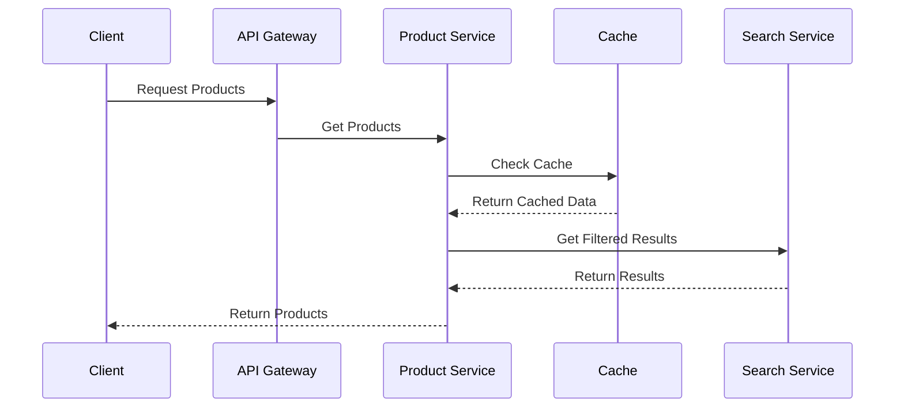

# E-commerce Product Listing Page

## Problem Statement

Design and implement a product listing page for an e-commerce platform similar to Amazon or Flipkart. The page should support:

- Product filtering and sorting
- Pagination and lazy loading
- Product comparison
- Wishlist functionality
- Performance optimization for large catalogs

## System Requirements

### Functional Requirements

1. **Product Display**

   - Product cards with images
   - Price and availability
   - Ratings and reviews
   - Quick view functionality
   - Product variants

2. **Filtering and Sorting**

   - Category filters
   - Price range filters
   - Brand filters
   - Rating filters
   - Multiple sort options

3. **User Features**
   - Wishlist management
   - Product comparison
   - Recently viewed
   - Search history
   - Personalization

### Non-Functional Requirements

1. **Performance**

   - Page load time < 2s
   - Filter response time < 500ms
   - Support for 1M+ products
   - 99.9% uptime

2. **Scalability**

   - Horizontal scaling
   - Data partitioning
   - Caching strategy
   - CDN integration

3. **Security**
   - Input validation
   - Rate limiting
   - DDoS protection
   - Data privacy

## High-Level Architecture

### Components

1. **Client Applications**

   - Web client (React)
   - Mobile clients (iOS/Android)
   - API Gateway

2. **Backend Services**

   - Product Service
   - Search Service
   - Filter Service
   - User Service
   - Analytics Service

3. **Data Storage**

   - Product Database (PostgreSQL)
   - Search Index (Elasticsearch)
   - Cache (Redis)
   - Media Storage (S3)
   - User Data (MongoDB)

4. **Real-time Features**
   - Price updates
   - Stock updates
   - User activity tracking

## Detailed Design

### 1. Product Listing Flow



### 2. Filtering System

1. **Filter Types**

   - Faceted search
   - Range filters
   - Boolean filters
   - Category tree

2. **Filter Implementation**
   - Elasticsearch aggregations
   - Redis caching
   - Filter combinations
   - Dynamic filter updates

### 3. Product Comparison

1. **Comparison Features**

   - Side-by-side comparison
   - Feature comparison
   - Price comparison
   - Availability comparison

2. **Implementation**
   - Client-side state
   - Local storage
   - Comparison API
   - Export functionality

### 4. Wishlist Management

1. **Wishlist Features**

   - Add/remove items
   - Share wishlist
   - Price alerts
   - Stock alerts

2. **Implementation**
   - User-specific storage
   - Real-time updates
   - Email notifications
   - Mobile notifications

## Database Schema

### Products Collection

```json
{
  "productId": "string",
  "name": "string",
  "description": "string",
  "price": {
    "current": "number",
    "original": "number",
    "currency": "string"
  },
  "images": [
    {
      "url": "string",
      "alt": "string"
    }
  ],
  "category": "string",
  "brand": "string",
  "attributes": {
    "key": "value"
  },
  "stock": "number",
  "rating": "number",
  "reviews": "number",
  "createdAt": "timestamp",
  "updatedAt": "timestamp"
}
```

### Categories Collection

```json
{
  "categoryId": "string",
  "name": "string",
  "parentId": "string",
  "path": ["string"],
  "attributes": [
    {
      "name": "string",
      "type": "string",
      "values": ["string"]
    }
  ],
  "createdAt": "timestamp"
}
```

### Users Collection

```json
{
  "userId": "string",
  "wishlist": [
    {
      "productId": "string",
      "addedAt": "timestamp"
    }
  ],
  "recentlyViewed": [
    {
      "productId": "string",
      "viewedAt": "timestamp"
    }
  ],
  "preferences": {
    "currency": "string",
    "language": "string"
  }
}
```

## API Endpoints

### Products

```
GET /api/products
GET /api/products/:productId
GET /api/products/search
GET /api/products/filters
```

### Categories

```
GET /api/categories
GET /api/categories/:categoryId
GET /api/categories/:categoryId/products
```

### User

```
GET /api/user/wishlist
POST /api/user/wishlist/:productId
DELETE /api/user/wishlist/:productId
GET /api/user/recently-viewed
```

### Comparison

```
GET /api/compare
POST /api/compare/:productId
DELETE /api/compare/:productId
```

## Implementation Considerations

### 1. Performance Optimization

- Implement infinite scroll
- Use Redis for caching
- Implement image lazy loading
- Use CDN for static assets
- Implement virtual scrolling

### 2. Search Optimization

- Use Elasticsearch for search
- Implement search suggestions
- Handle typos and synonyms
- Implement relevance scoring
- Use search analytics

### 3. Security Measures

- Implement rate limiting
- Use JWT for authentication
- Validate user input
- Implement CSRF protection
- Use HTTPS for all communications

### 4. Monitoring and Analytics

- Track page performance
- Monitor user behavior
- Log error rates
- Track conversion metrics

## Testing Strategy

### 1. Unit Tests

- Product filtering
- Sorting logic
- Price calculations
- Image loading

### 2. Integration Tests

- Filter combinations
- Search functionality
- Wishlist operations
- Comparison features

### 3. Load Tests

- Concurrent users
- Filter performance
- Search performance
- Image loading

### 4. Security Tests

- Authentication
- Authorization
- Rate limiting
- Input validation

## Deployment Strategy

### 1. Infrastructure

- Use Kubernetes for container orchestration
- Implement auto-scaling
- Use multiple availability zones
- Implement disaster recovery

### 2. CI/CD

- Automated testing
- Blue-green deployment
- Rollback capability
- Monitoring and alerts

## Future Enhancements

1. **Advanced Features**

   - AR product preview
   - Voice search
   - Social sharing
   - Product recommendations
   - Price history

2. **AI Features**

   - Personalized recommendations
   - Visual search
   - Size recommendations
   - Price predictions

3. **Analytics**
   - User behavior tracking
   - Conversion analytics
   - Product performance
   - Business insights

## Conclusion

This system design provides a scalable and maintainable architecture for an e-commerce product listing page. The design focuses on:

- Performance optimization
- Search and filtering
- User experience
- Scalability
- Security

The implementation should be done in phases, starting with core features and gradually adding more complex functionality.
