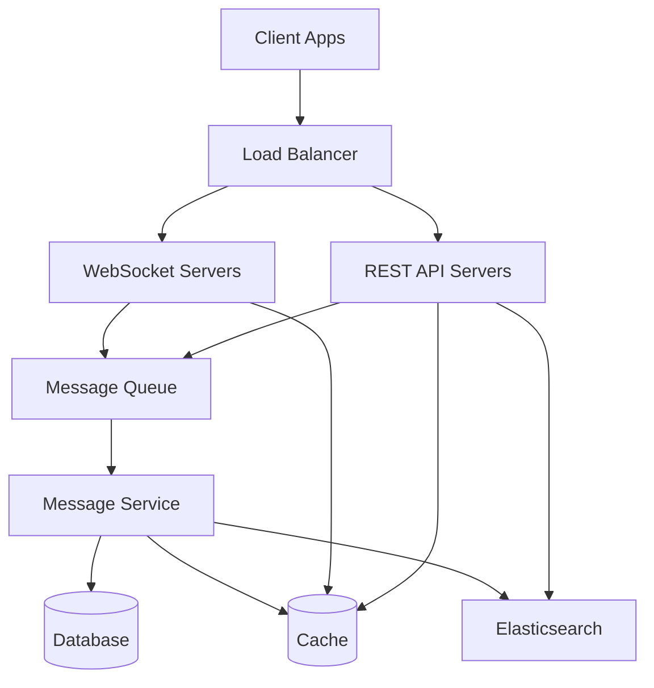
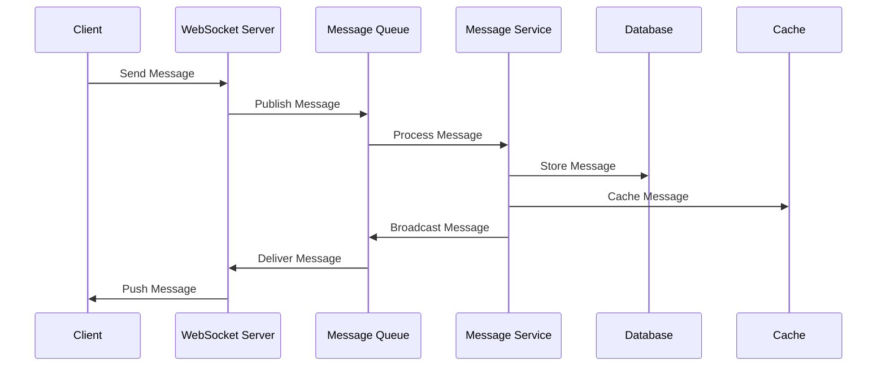

# Design a Real-time Chat System

## Problem Statement

Design a real-time chat system that supports millions of concurrent users with features like message delivery, read receipts, typing indicators, and message persistence. The system should be highly available, scalable, and maintain low latency for real-time communication.

## Requirements

### Functional Requirements

- Real-time message delivery
- One-to-one and group chats
- Message persistence
- Read receipts
- Typing indicators
- Online/offline status
- Message search
- File sharing
- Message deletion
- User presence

### Non-Functional Requirements

- High availability (99.9% uptime)
- Low latency (< 100ms for message delivery)
- Scalability to handle millions of concurrent users
- Data consistency
- Security and privacy
- Message ordering
- Message delivery guarantees

## Solution

### System Architecture



### High-Level Design (HLD)

#### 1. Client Layer
- Web/Mobile clients
- WebSocket connection management
- Message queuing and retry logic
- Offline message handling
- Local message persistence

#### 2. Load Balancer Layer
- WebSocket connection routing
- REST API request routing
- Health checks
- SSL termination
- Rate limiting

#### 3. WebSocket Layer
- Connection management
- Message broadcasting
- Presence management
- Connection state handling
- Heartbeat mechanism

#### 4. Message Queue Layer
- Message buffering
- Message ordering
- Message persistence
- Dead letter queues
- Message routing

#### 5. Service Layer
- Message Service
- User Service
- Presence Service
- Search Service
- File Service

#### 6. Storage Layer
- Primary Database
- Cache
- Search Index
- File Storage

### Low-Level Design (LLD)

#### 1. Message Flow



#### 2. Data Models

```sql
-- Users Table
CREATE TABLE users (
    id SERIAL PRIMARY KEY,
    username VARCHAR(50) UNIQUE NOT NULL,
    email VARCHAR(255) UNIQUE NOT NULL,
    password_hash VARCHAR(255) NOT NULL,
    status VARCHAR(20) DEFAULT 'offline',
    last_seen TIMESTAMP,
    created_at TIMESTAMP DEFAULT CURRENT_TIMESTAMP
);

-- Conversations Table
CREATE TABLE conversations (
    id SERIAL PRIMARY KEY,
    type VARCHAR(20) NOT NULL, -- 'direct' or 'group'
    name VARCHAR(100),
    created_at TIMESTAMP DEFAULT CURRENT_TIMESTAMP,
    updated_at TIMESTAMP DEFAULT CURRENT_TIMESTAMP
);

-- Conversation Members Table
CREATE TABLE conversation_members (
    conversation_id INTEGER REFERENCES conversations(id),
    user_id INTEGER REFERENCES users(id),
    role VARCHAR(20) DEFAULT 'member',
    joined_at TIMESTAMP DEFAULT CURRENT_TIMESTAMP,
    PRIMARY KEY (conversation_id, user_id)
);

-- Messages Table
CREATE TABLE messages (
    id SERIAL PRIMARY KEY,
    conversation_id INTEGER REFERENCES conversations(id),
    sender_id INTEGER REFERENCES users(id),
    content TEXT,
    type VARCHAR(20) DEFAULT 'text', -- 'text', 'file', 'image'
    file_url VARCHAR(255),
    created_at TIMESTAMP DEFAULT CURRENT_TIMESTAMP,
    updated_at TIMESTAMP DEFAULT CURRENT_TIMESTAMP,
    deleted_at TIMESTAMP
);

-- Message Status Table
CREATE TABLE message_status (
    message_id INTEGER REFERENCES messages(id),
    user_id INTEGER REFERENCES users(id),
    status VARCHAR(20) DEFAULT 'sent', -- 'sent', 'delivered', 'read'
    updated_at TIMESTAMP DEFAULT CURRENT_TIMESTAMP,
    PRIMARY KEY (message_id, user_id)
);
```

#### 3. WebSocket Protocol

```typescript
// Message Types
interface Message {
  type: 'text' | 'file' | 'image';
  content: string;
  conversationId: string;
  senderId: string;
  timestamp: number;
}

// WebSocket Events
enum WebSocketEvent {
  MESSAGE = 'message',
  TYPING = 'typing',
  PRESENCE = 'presence',
  READ_RECEIPT = 'read_receipt',
  ERROR = 'error'
}

// WebSocket Message Handler
class WebSocketHandler {
  private connections: Map<string, WebSocket>;
  private userPresence: Map<string, boolean>;

  async handleMessage(ws: WebSocket, message: Message) {
    try {
      // Validate message
      this.validateMessage(message);

      // Store message
      await this.messageService.storeMessage(message);

      // Broadcast to conversation members
      await this.broadcastToConversation(message);

      // Send acknowledgment
      ws.send(JSON.stringify({
        type: 'ack',
        messageId: message.id
      }));
    } catch (error) {
      ws.send(JSON.stringify({
        type: 'error',
        error: error.message
      }));
    }
  }

  private async broadcastToConversation(message: Message) {
    const members = await this.conversationService.getMembers(message.conversationId);
    for (const member of members) {
      if (this.connections.has(member.id)) {
        this.connections.get(member.id).send(JSON.stringify(message));
      }
    }
  }
}
```

#### 4. Message Queue Implementation

```typescript
// Message Queue Handler
class MessageQueueHandler {
  private readonly queue: Queue;
  private readonly messageService: MessageService;

  async processMessage(message: Message) {
    try {
      // Store message
      await this.messageService.storeMessage(message);

      // Update conversation
      await this.conversationService.updateLastMessage(message);

      // Notify users
      await this.notificationService.notifyUsers(message);

      // Index message for search
      await this.searchService.indexMessage(message);
    } catch (error) {
      // Handle error and retry
      await this.handleError(message, error);
    }
  }

  private async handleError(message: Message, error: Error) {
    if (this.shouldRetry(error)) {
      await this.queue.retry(message);
    } else {
      await this.queue.deadLetter(message);
    }
  }
}
```

## Implementation Details

### 1. WebSocket Connection Management

```typescript
class WebSocketManager {
  private readonly connections: Map<string, WebSocket>;
  private readonly heartbeatInterval: number = 30000;

  constructor() {
    this.connections = new Map();
  }

  handleConnection(ws: WebSocket, userId: string) {
    this.connections.set(userId, ws);
    this.setupHeartbeat(ws);
    this.updateUserPresence(userId, true);
  }

  private setupHeartbeat(ws: WebSocket) {
    const interval = setInterval(() => {
      if (ws.readyState === WebSocket.OPEN) {
        ws.ping();
      } else {
        clearInterval(interval);
        this.handleDisconnection(ws);
      }
    }, this.heartbeatInterval);
  }

  private handleDisconnection(ws: WebSocket) {
    const userId = this.getUserIdFromConnection(ws);
    if (userId) {
      this.connections.delete(userId);
      this.updateUserPresence(userId, false);
    }
  }
}
```

### 2. Message Persistence

```typescript
class MessageService {
  private readonly db: Database;
  private readonly cache: Cache;

  async storeMessage(message: Message): Promise<void> {
    // Store in database
    await this.db.transaction(async (trx) => {
      await trx('messages').insert({
        conversation_id: message.conversationId,
        sender_id: message.senderId,
        content: message.content,
        type: message.type,
        created_at: new Date(message.timestamp)
      });
    });

    // Cache recent messages
    await this.cache.set(
      `conversation:${message.conversationId}:messages`,
      message,
      '1h'
    );
  }

  async getMessages(conversationId: string, limit: number = 50): Promise<Message[]> {
    // Try cache first
    const cached = await this.cache.get(`conversation:${conversationId}:messages`);
    if (cached) return cached;

    // Fetch from database
    const messages = await this.db('messages')
      .where('conversation_id', conversationId)
      .orderBy('created_at', 'desc')
      .limit(limit);

    // Cache results
    await this.cache.set(
      `conversation:${conversationId}:messages`,
      messages,
      '1h'
    );

    return messages;
  }
}
```

## Scaling Considerations

### 1. Horizontal Scaling
- WebSocket servers behind load balancer
- Message queue partitioning
- Database sharding
- Cache distribution

### 2. Performance Optimization
- Message batching
- Connection pooling
- Caching strategies
- Database indexing

### 3. Reliability
- Message persistence
- Retry mechanisms
- Error handling
- Circuit breakers

### 4. Monitoring
- Connection metrics
- Message latency
- Error rates
- Resource usage

## Interview Time Management

### 45 Minutes
1. Requirements gathering (5 mins)
2. High-level design (10 mins)
3. Data models (10 mins)
4. Basic implementation (15 mins)
5. Scaling discussion (5 mins)

### 60 Minutes
1. Requirements gathering (10 mins)
2. High-level design (15 mins)
3. Data models (15 mins)
4. Implementation details (15 mins)
5. Scaling and optimization (5 mins)

### 90 Minutes
1. Requirements gathering (15 mins)
2. High-level design (20 mins)
3. Data models (20 mins)
4. Implementation details (20 mins)
5. Scaling and optimization (10 mins)
6. Edge cases and improvements (5 mins)

## Trade-offs

1. **Consistency vs. Availability**
   - Strong consistency requires more coordination
   - Eventual consistency improves availability
   - Solution: Use eventual consistency with message ordering

2. **Real-time vs. Performance**
   - Immediate delivery increases latency
   - Batching improves performance
   - Solution: Use adaptive batching based on load

3. **Storage vs. Performance**
   - More storage improves reliability
   - Less storage improves performance
   - Solution: Use tiered storage with caching

## Future Improvements

1. **Features**
   - End-to-end encryption
   - Message reactions
   - Voice/video calls
   - Message translation

2. **Performance**
   - Edge caching
   - Message compression
   - Connection optimization
   - Database optimization

3. **Reliability**
   - Better error handling
   - Improved monitoring
   - Automated recovery
   - Disaster recovery 