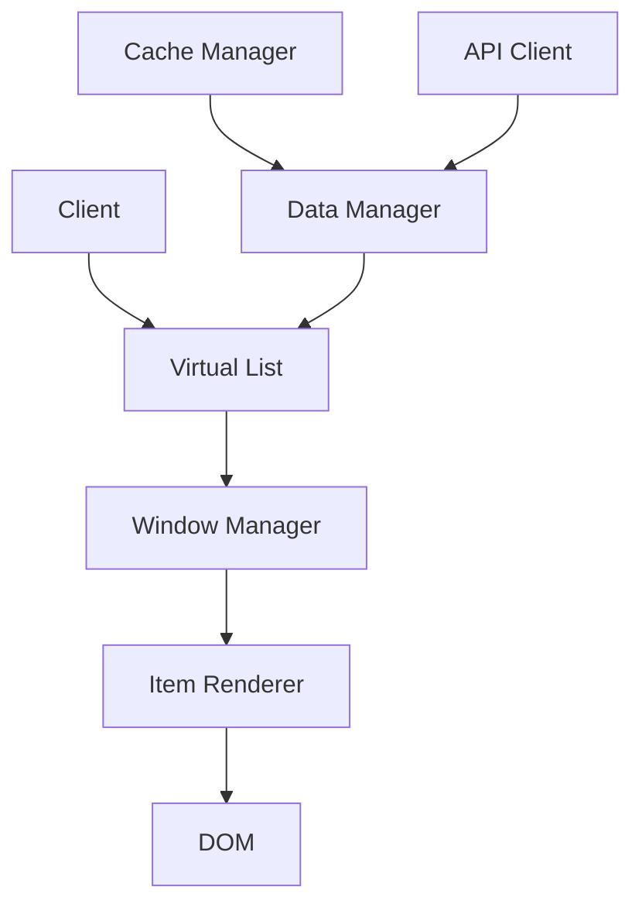
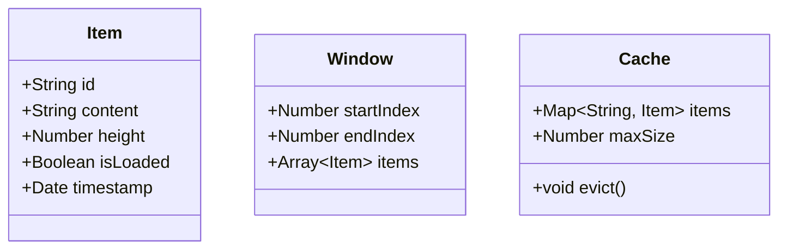

# Design an Infinite Scroll System

## Problem Statement
Design a system that efficiently loads and renders large lists of content with infinite scrolling, handling memory management, performance optimization, and smooth user experience.

## Clarifying Questions

1. What type of content will be displayed in the infinite scroll?
   - Images, text, or mixed content
   - Size and complexity of each item
   - Expected number of items

2. What are the performance requirements?
   - Initial load time
   - Scroll performance
   - Memory usage limits

3. What are the browser/device requirements?
   - Supported browsers
   - Mobile vs desktop
   - Minimum device specifications

4. What features are required?
   - Pull-to-refresh
   - Scroll-to-top
   - Loading indicators
   - Error handling
   - Offline support

## Requirements

### Functional Requirements
1. Load and display content dynamically as user scrolls
2. Maintain smooth scrolling performance
3. Handle loading states and errors gracefully
4. Support different types of content (images, text, etc.)
5. Implement efficient memory management
6. Provide visual feedback during loading

### Non-Functional Requirements
1. Performance
   - Initial load time < 2 seconds
   - Smooth scrolling (60 FPS)
   - Memory usage < 100MB
2. Scalability
   - Support for large datasets
   - Efficient data fetching
3. Reliability
   - Error handling
   - Offline support
   - Data persistence

## High-Level Design



## Data Model



## Component Design

### 1. Virtual List Component
- Manages the virtual window
- Handles scroll events
- Calculates visible items
- Manages item recycling

### 2. Window Manager
- Tracks visible items
- Manages item recycling
- Handles scroll position
- Calculates item positions

### 3. Item Renderer
- Renders individual items
- Handles item lifecycle
- Manages item state
- Implements lazy loading

### 4. Data Manager
- Manages data fetching
- Handles caching
- Implements pagination
- Manages data state

## Implementation Details

### 1. Virtual List Implementation
```typescript
interface VirtualListProps {
  items: Item[];
  itemHeight: number;
  windowHeight: number;
  overscan: number;
}

class VirtualList {
  private visibleItems: Item[] = [];
  private startIndex: number = 0;
  private endIndex: number = 0;

  constructor(props: VirtualListProps) {
    this.calculateVisibleItems();
  }

  private calculateVisibleItems() {
    const scrollTop = window.scrollY;
    this.startIndex = Math.floor(scrollTop / this.props.itemHeight);
    this.endIndex = Math.ceil((scrollTop + this.props.windowHeight) / this.props.itemHeight);
    this.visibleItems = this.props.items.slice(
      Math.max(0, this.startIndex - this.props.overscan),
      Math.min(this.props.items.length, this.endIndex + this.props.overscan)
    );
  }
}
```

### 2. Memory Management
```typescript
class MemoryManager {
  private cache: Map<string, Item> = new Map();
  private maxSize: number = 1000;

  addItem(item: Item) {
    if (this.cache.size >= this.maxSize) {
      this.evictOldest();
    }
    this.cache.set(item.id, item);
  }

  private evictOldest() {
    const oldestKey = this.cache.keys().next().value;
    this.cache.delete(oldestKey);
  }
}
```

### 3. Performance Optimization
```typescript
class PerformanceOptimizer {
  private rafId: number | null = null;
  private lastScrollTime: number = 0;
  private scrollThrottle: number = 16; // 60fps

  handleScroll() {
    if (this.rafId) {
      cancelAnimationFrame(this.rafId);
    }

    this.rafId = requestAnimationFrame(() => {
      const now = Date.now();
      if (now - this.lastScrollTime >= this.scrollThrottle) {
        this.updateVisibleItems();
        this.lastScrollTime = now;
      }
    });
  }
}
```

## Scaling Considerations

1. Data Management
   - Implement efficient data fetching
   - Use cursor-based pagination
   - Implement data caching
   - Handle data updates

2. Performance
   - Use windowing technique
   - Implement item recycling
   - Optimize render cycles
   - Use efficient DOM operations

3. Memory
   - Implement item cleanup
   - Use weak references
   - Monitor memory usage
   - Implement garbage collection

## Testing Strategy

1. Unit Tests
   - Test individual components
   - Test data management
   - Test memory management
   - Test performance optimizations

2. Integration Tests
   - Test component interactions
   - Test data flow
   - Test error handling
   - Test edge cases

3. Performance Tests
   - Test scroll performance
   - Test memory usage
   - Test load times
   - Test with large datasets

## Monitoring and Metrics

1. Performance Metrics
   - FPS during scrolling
   - Memory usage
   - Load times
   - Render times

2. User Experience Metrics
   - Scroll smoothness
   - Loading times
   - Error rates
   - User interactions

## Common Pitfalls and Solutions

1. Memory Leaks
   - Solution: Implement proper cleanup
   - Solution: Use weak references
   - Solution: Monitor memory usage

2. Performance Issues
   - Solution: Use windowing
   - Solution: Implement recycling
   - Solution: Optimize renders

3. Scroll Jank
   - Solution: Use requestAnimationFrame
   - Solution: Implement throttling
   - Solution: Optimize DOM operations

## Additional Considerations

1. Accessibility
   - Keyboard navigation
   - Screen reader support
   - Focus management
   - ARIA attributes

2. Browser Support
   - Fallback strategies
   - Polyfills
   - Feature detection
   - Progressive enhancement

3. Mobile Considerations
   - Touch events
   - Mobile performance
   - Battery usage
   - Network conditions 