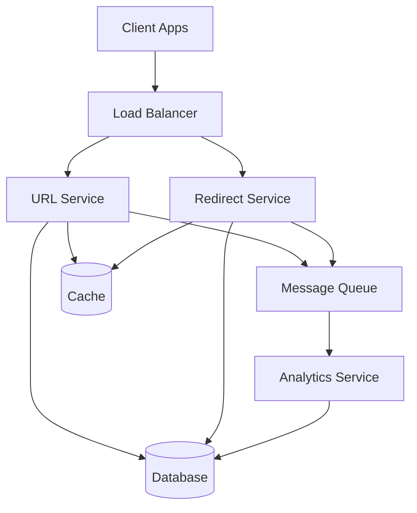
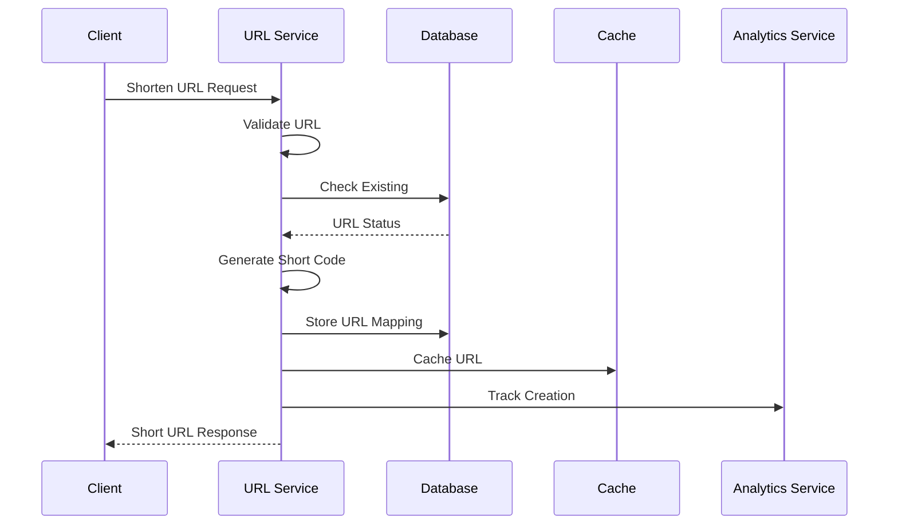

# Design a URL Shortening Service

## Problem Statement

Design a URL shortening service that converts long URLs into shorter, more manageable links. The service should be highly available, scalable, and maintain low latency for URL redirections.

## Requirements

### Functional Requirements

- Convert long URLs into short URLs
- Redirect users from short URLs to original URLs
- Support custom short URLs
- Track click analytics
- Handle URL expiration
- Support URL validation
- Handle URL conflicts
- Support URL deletion

### Non-Functional Requirements

- High availability (99.9% uptime)
- Low latency (< 100ms for redirections)
- Scalability to handle millions of requests per day
- Data consistency
- Security against malicious URLs
- Rate limiting
- Analytics accuracy

## Solution

### System Architecture



### High-Level Design (HLD)

#### 1. Client Layer
- Web/Mobile clients
- API clients
- Browser extensions
- Mobile SDKs

#### 2. Load Balancer Layer
- Request routing
- SSL termination
- Rate limiting
- Health checks
- Geographic routing

#### 3. URL Service Layer
- URL shortening
- URL validation
- Custom URL handling
- URL expiration
- URL deletion

#### 4. Redirect Service Layer
- URL redirection
- Cache management
- Analytics collection
- Rate limiting
- Security checks

#### 5. Analytics Service Layer
- Click tracking
- Data aggregation
- Report generation
- Data retention
- Data export

#### 6. Storage Layer
- Primary Database
- Cache
- Analytics Storage
- Backup Storage

### Low-Level Design (LLD)

#### 1. URL Generation Flow



#### 2. Data Models

```sql
-- URLs Table
CREATE TABLE urls (
    id SERIAL PRIMARY KEY,
    short_code VARCHAR(10) UNIQUE NOT NULL,
    long_url TEXT NOT NULL,
    user_id INTEGER REFERENCES users(id),
    is_custom BOOLEAN DEFAULT FALSE,
    created_at TIMESTAMP DEFAULT CURRENT_TIMESTAMP,
    expires_at TIMESTAMP,
    is_active BOOLEAN DEFAULT TRUE,
    click_count INTEGER DEFAULT 0,
    last_accessed_at TIMESTAMP
);

-- Analytics Table
CREATE TABLE analytics (
    id SERIAL PRIMARY KEY,
    url_id INTEGER REFERENCES urls(id),
    ip_address VARCHAR(45),
    user_agent TEXT,
    referrer TEXT,
    country VARCHAR(2),
    device_type VARCHAR(20),
    browser VARCHAR(50),
    os VARCHAR(50),
    created_at TIMESTAMP DEFAULT CURRENT_TIMESTAMP
);

-- Users Table
CREATE TABLE users (
    id SERIAL PRIMARY KEY,
    email VARCHAR(255) UNIQUE NOT NULL,
    password_hash VARCHAR(255) NOT NULL,
    created_at TIMESTAMP DEFAULT CURRENT_TIMESTAMP,
    last_login_at TIMESTAMP
);
```

#### 3. URL Service Implementation

```typescript
class URLService {
  private readonly db: Database;
  private readonly cache: Cache;
  private readonly analytics: AnalyticsService;

  async shortenURL(longURL: string, userId?: string, customCode?: string): Promise<string> {
    // Validate URL
    this.validateURL(longURL);

    // Check for existing URL
    const existing = await this.findExistingURL(longURL, userId);
    if (existing) return existing.shortCode;

    // Generate or use custom code
    const shortCode = customCode || await this.generateShortCode();

    // Store URL mapping
    await this.db.transaction(async (trx) => {
      await trx('urls').insert({
        short_code: shortCode,
        long_url: longURL,
        user_id: userId,
        is_custom: !!customCode,
        created_at: new Date(),
        expires_at: this.calculateExpiry()
      });
    });

    // Cache URL
    await this.cache.set(`url:${shortCode}`, longURL, '24h');

    // Track creation
    await this.analytics.trackURLCreation(shortCode, userId);

    return shortCode;
  }

  private async generateShortCode(): Promise<string> {
    const code = this.generateRandomCode();
    const exists = await this.db('urls').where('short_code', code).first();
    return exists ? this.generateShortCode() : code;
  }

  private generateRandomCode(): string {
    const chars = 'abcdefghijklmnopqrstuvwxyzABCDEFGHIJKLMNOPQRSTUVWXYZ0123456789';
    let code = '';
    for (let i = 0; i < 7; i++) {
      code += chars[Math.floor(Math.random() * chars.length)];
    }
    return code;
  }
}
```

#### 4. Redirect Service Implementation

```typescript
class RedirectService {
  private readonly db: Database;
  private readonly cache: Cache;
  private readonly analytics: AnalyticsService;

  async redirect(shortCode: string, request: Request): Promise<string> {
    // Try cache first
    const cachedURL = await this.cache.get(`url:${shortCode}`);
    if (cachedURL) {
      this.trackRedirect(shortCode, request);
      return cachedURL;
    }

    // Fetch from database
    const url = await this.db('urls')
      .where('short_code', shortCode)
      .where('is_active', true)
      .first();

    if (!url) throw new Error('URL not found');

    // Check expiration
    if (url.expires_at && new Date(url.expires_at) < new Date()) {
      throw new Error('URL expired');
    }

    // Cache URL
    await this.cache.set(`url:${shortCode}`, url.long_url, '24h');

    // Track redirect
    this.trackRedirect(shortCode, request);

    return url.long_url;
  }

  private async trackRedirect(shortCode: string, request: Request): Promise<void> {
    await this.analytics.trackRedirect({
      shortCode,
      ipAddress: request.ip,
      userAgent: request.headers['user-agent'],
      referrer: request.headers['referer'],
      country: this.getCountryFromIP(request.ip)
    });
  }
}
```

## Implementation Details

### 1. URL Generation

```typescript
class URLGenerator {
  private readonly base62 = 'abcdefghijklmnopqrstuvwxyzABCDEFGHIJKLMNOPQRSTUVWXYZ0123456789';
  private readonly base = this.base62.length;

  generateShortURL(id: number): string {
    let shortURL = '';
    while (id > 0) {
      shortURL = this.base62[id % this.base] + shortURL;
      id = Math.floor(id / this.base);
    }
    return shortURL.padStart(7, this.base62[0]);
  }

  decodeShortURL(shortURL: string): number {
    let id = 0;
    for (let i = 0; i < shortURL.length; i++) {
      id = id * this.base + this.base62.indexOf(shortURL[i]);
    }
    return id;
  }
}
```

### 2. Caching Strategy

```typescript
class URLCache {
  private readonly redis: Redis;
  private readonly ttl: number = 24 * 60 * 60; // 24 hours

  async cacheURL(shortCode: string, longURL: string): Promise<void> {
    await this.redis.set(
      `url:${shortCode}`,
      longURL,
      'EX',
      this.ttl
    );
  }

  async getURL(shortCode: string): Promise<string | null> {
    return await this.redis.get(`url:${shortCode}`);
  }

  async invalidateURL(shortCode: string): Promise<void> {
    await this.redis.del(`url:${shortCode}`);
  }
}
```

## Scaling Considerations

### 1. Horizontal Scaling
- Multiple URL service instances
- Multiple redirect service instances
- Database sharding
- Cache distribution

### 2. Performance Optimization
- URL caching
- Database indexing
- Connection pooling
- Request batching

### 3. Reliability
- Data replication
- Failover mechanisms
- Backup strategies
- Error handling

### 4. Monitoring
- Request latency
- Cache hit rates
- Error rates
- Resource usage

## Interview Time Management

### 45 Minutes
1. Requirements gathering (5 mins)
2. High-level design (10 mins)
3. Data models (10 mins)
4. Basic implementation (15 mins)
5. Scaling discussion (5 mins)

### 60 Minutes
1. Requirements gathering (10 mins)
2. High-level design (15 mins)
3. Data models (15 mins)
4. Implementation details (15 mins)
5. Scaling and optimization (5 mins)

### 90 Minutes
1. Requirements gathering (15 mins)
2. High-level design (20 mins)
3. Data models (20 mins)
4. Implementation details (20 mins)
5. Scaling and optimization (10 mins)
6. Edge cases and improvements (5 mins)

## Trade-offs

1. **Short URL Length vs. Collision Probability**
   - Shorter URLs are more user-friendly
   - Longer URLs reduce collision probability
   - Solution: Use 7 characters (62^7 possibilities)

2. **Cache Size vs. Memory Usage**
   - Larger cache improves performance
   - Limited by available memory
   - Solution: Use LRU cache with size limits

3. **Analytics Granularity vs. Storage**
   - Detailed analytics provide better insights
   - Requires more storage
   - Solution: Aggregate data periodically

## Future Improvements

1. **Features**
   - URL preview
   - QR code generation
   - Custom domains
   - API rate limiting

2. **Performance**
   - Edge caching
   - CDN integration
   - Database optimizations

3. **Security**
   - URL validation
   - Malware scanning
   - Rate limiting
   - Access control
