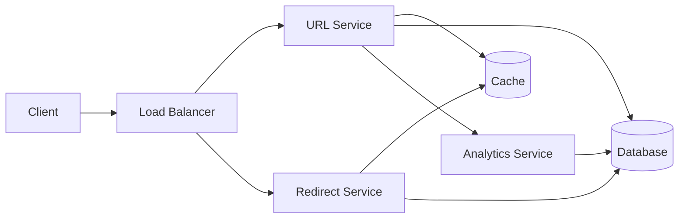

# Design a URL Shortening Service

## Problem Statement

Design a URL shortening service that converts long URLs into shorter, more manageable links. The service should be highly available, scalable, and maintain low latency for URL redirections.

## Requirements

### Functional Requirements

- Convert long URLs into short URLs
- Redirect users from short URLs to original URLs
- Support custom short URLs
- Track click analytics
- Handle URL expiration

### Non-Functional Requirements

- High availability (99.9% uptime)
- Low latency (< 100ms for redirections)
- Scalability to handle millions of requests per day
- Data consistency
- Security against malicious URLs

## Solution

### System Architecture



### Components

1. **URL Service**

   - Handles URL shortening requests
   - Generates unique short codes
   - Manages custom URLs
   - Validates URLs

2. **Redirect Service**

   - Handles redirection requests
   - Implements caching strategy
   - Tracks analytics

3. **Analytics Service**

   - Collects click data
   - Generates reports
   - Handles data aggregation

4. **Database**

   - Stores URL mappings
   - Maintains analytics data
   - Handles user data

5. **Cache**
   - Caches frequently accessed URLs
   - Reduces database load
   - Improves response time

### Data Models

#### URLs Table

```sql
CREATE TABLE urls (
    id SERIAL PRIMARY KEY,
    short_code VARCHAR(10) UNIQUE NOT NULL,
    long_url TEXT NOT NULL,
    created_at TIMESTAMP DEFAULT CURRENT_TIMESTAMP,
    expires_at TIMESTAMP,
    user_id INTEGER REFERENCES users(id),
    is_custom BOOLEAN DEFAULT FALSE,
    click_count INTEGER DEFAULT 0
);
```

#### Analytics Table

```sql
CREATE TABLE analytics (
    id SERIAL PRIMARY KEY,
    url_id INTEGER REFERENCES urls(id),
    ip_address VARCHAR(45),
    user_agent TEXT,
    referrer TEXT,
    country VARCHAR(2),
    created_at TIMESTAMP DEFAULT CURRENT_TIMESTAMP
);
```

## Implementation Details

### URL Generation

```java
public class URLShortener {
    private static final String ALPHABET = "abcdefghijklmnopqrstuvwxyzABCDEFGHIJKLMNOPQRSTUVWXYZ0123456789";
    private static final int BASE = ALPHABET.length();

    public String generateShortURL(String longURL) {
        // Generate a unique ID (e.g., using timestamp + random number)
        long id = generateUniqueId();
        return encode(id);
    }

    private String encode(long id) {
        StringBuilder shortURL = new StringBuilder();
        while (id > 0) {
            shortURL.append(ALPHABET.charAt((int) (id % BASE)));
            id /= BASE;
        }
        return shortURL.reverse().toString();
    }

    private long generateUniqueId() {
        // Implementation using timestamp and random number
        return System.currentTimeMillis() * 1000 + new Random().nextInt(1000);
    }
}
```

### Caching Strategy

```java
public class URLCache {
    private final RedisTemplate<String, String> redisTemplate;
    private static final int CACHE_TTL = 24 * 60 * 60; // 24 hours

    public void cacheURL(String shortCode, String longURL) {
        redisTemplate.opsForValue().set(
            "url:" + shortCode,
            longURL,
            CACHE_TTL,
            TimeUnit.SECONDS
        );
    }

    public String getLongURL(String shortCode) {
        return redisTemplate.opsForValue().get("url:" + shortCode);
    }
}
```

## Scaling Considerations

1. **Horizontal Scaling**

   - Use multiple instances of each service
   - Implement load balancing
   - Use distributed caching

2. **Database Scaling**

   - Implement database sharding
   - Use read replicas
   - Optimize indexes

3. **Caching Strategy**

   - Use distributed caching (Redis)
   - Implement cache invalidation
   - Handle cache misses

4. **Monitoring and Analytics**
   - Track service metrics
   - Monitor cache hit rates
   - Analyze user patterns

## Trade-offs

1. **Short URL Length vs. Collision Probability**

   - Shorter URLs are more user-friendly
   - Longer URLs reduce collision probability
   - Solution: Use 7 characters (62^7 possibilities)

2. **Cache Size vs. Memory Usage**

   - Larger cache improves performance
   - Limited by available memory
   - Solution: Use LRU cache with size limits

3. **Analytics Granularity vs. Storage**
   - Detailed analytics provide better insights
   - Requires more storage
   - Solution: Aggregate data periodically

## Future Improvements

1. **Additional Features**

   - URL preview
   - QR code generation
   - Custom domains
   - API rate limiting

2. **Performance Optimizations**

   - Edge caching
   - CDN integration
   - Database optimizations

3. **Security Enhancements**
   - URL validation
   - Malware scanning
   - Rate limiting
   - Access control
